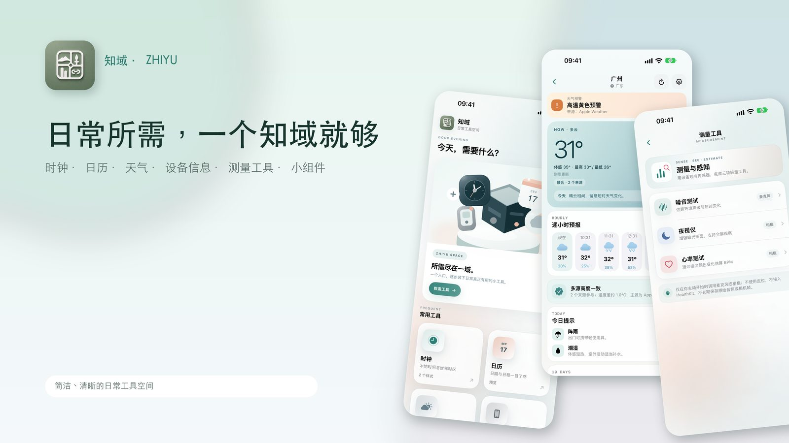
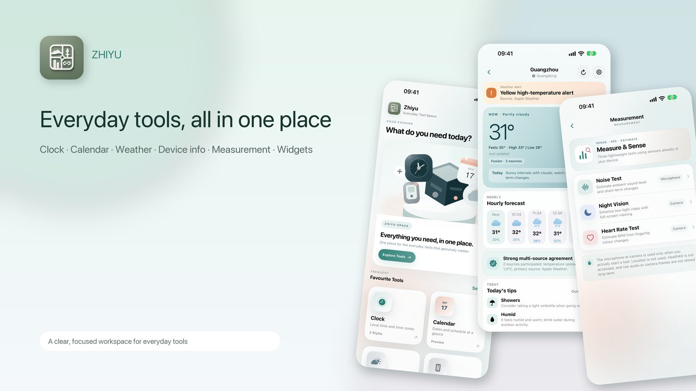

# 知域 · Zhiyu

**日常工具，自成一域。** · *Everyday tools, beautifully together.*

知域是一款为 iPhone 与 iPad 设计的日常工具 App。  
把时间、日历、天气和设备信息放在同一个清晰、舒适的空间，让常用工具更容易找到，也更顺手。

**[前往 App Store 下载知域](https://apps.apple.com/hk/app/%E7%9F%A5%E5%9F%9F-%E5%B7%A5%E5%85%B7%E7%AE%B1/id6799164439)** · **[访问官方网站](https://zzhdong.github.io/zhiyu/)** · **[技术支持](https://zzhdong.github.io/zhiyu/support/)**

  

> **已在 App Store 上架** · 支持 iPhone / iPad · 需要 iOS / iPadOS 17.6 或更高版本

### 一个空间，日常所需

- **时钟与世界时间** — 清晰查看本地时间和不同时区，并用桌面小组件把时间放在眼前。
- **日历与重要日期** — 浏览公历、农历、节假日与提醒；需要时可授权接入系统日历。
- **天气与地点** — 查看所选城市或当前位置的天气预报，使用 Apple Weather 与 MET Norway 数据。
- **设备信息** — 了解设备、系统、存储、电池及网络状态，并按需使用设备功能检测工具。
- **实用桌面小组件** — 在主屏幕快速查看时间、日历、天气和设备信息。

### 简单使用，尊重选择

知域采用**一次性付费下载**，当前没有订阅、应用内购买或广告 SDK，也不要求注册账号。

多数设置与缓存保存在设备上。定位、日历、相机等权限仅在相关功能需要时申请；天气服务会按功能需要向天气提供方发送查询地点信息。详细的数据处理方式，请阅读 **[隐私政策](https://zzhdong.github.io/zhiyu/privacy/)**。

### 帮助与反馈

遇到天气刷新、日历提醒、小组件或设备功能方面的问题，可访问 **[技术支持](https://zzhdong.github.io/zhiyu/support/)**，或发送邮件至 **[zzhdong@gmail.com](mailto:zzhdong@gmail.com)**。

建议说明设备型号、系统版本、App 版本及复现步骤；请勿发送密码、精确位置或其他无关的敏感信息。

---

## English

  

**Zhiyu — Everyday tools, beautifully together.**

Zhiyu is an everyday utilities app for iPhone and iPad, bringing time, calendars, weather and device information into one thoughtfully organised space.

**[Download on the App Store](https://apps.apple.com/hk/app/%E7%9F%A5%E5%9F%9F-%E5%B7%A5%E5%85%B7%E7%AE%B1/id6799164439)** · **[Official website](https://zzhdong.github.io/zhiyu/en/)** · **[Support](https://zzhdong.github.io/zhiyu/en/support/)**

### Everyday essentials, in one place

- **Clock & world time** — Check local time and time zones, with Home Screen clock widgets.
- **Calendar & important dates** — Browse dates, lunar-calendar information and holidays, manage reminders, and optionally access your system calendar.
- **Weather & places** — See forecasts for saved places or your current location, powered by Apple Weather and MET Norway.
- **Device information** — Explore device, system, storage, battery and network information, with optional on-demand device checks.
- **Home Screen widgets** — Keep useful clock, calendar, weather and device information close at hand.

### Privacy and choice

Zhiyu is a **one-time paid download**, with no subscriptions, in-app purchases or advertising SDKs in the current release. No account is required.

Preferences and caches are kept on your device wherever possible. System permissions are requested when you use the relevant features; weather requests send the necessary location information to weather providers. See the **[Privacy Policy](https://zzhdong.github.io/zhiyu/en/privacy/)** for details.

### Support

For help with weather, calendars, widgets or device tools, visit **[Support](https://zzhdong.github.io/zhiyu/support/)** or email **[zzhdong@gmail.com](mailto:zzhdong@gmail.com)**. Please include your device model, OS version, app version and steps to reproduce, without sharing unrelated sensitive data.

---

*This public repository hosts the official website, privacy policy and support pages for Zhiyu. The app source code is maintained separately.*

© 2026 Zhiyu
